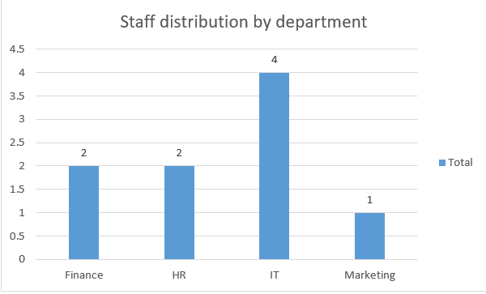
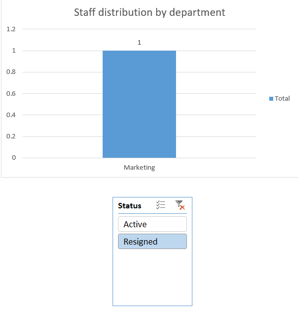
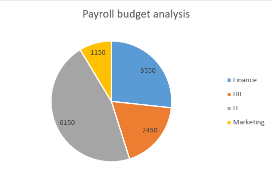
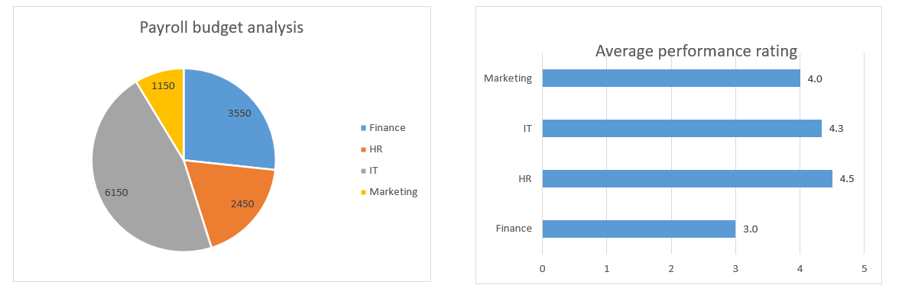

# Analysis Report & Business Insights

## Introduction
This report provides a detailed analysis of the employee dataset. The goal is to transform raw data into actionable insights 
that help management make informed decisions regarding budget allocation, performance evaluation, and workforce planning.

1) Which department currently has the largest number of employees?
   The IT department is the largest, with 4 employees.

  

2) What is the ratio of resigned employees to active ones?
   One employee resigned in the marketing department.

  

3) Which department consumes the highest percentage of the payroll budget?
   The IT department consumes 6150

  

4) Which department is the most efficient based on performance evaluation?
   The HR department is the most efficient with an average rating of 4.5, followed by the IT department with an average of 4.3.

5) Is there a gap between salaries and performance in a particular department?
   We note that the Finance and Marketing departments receive good salaries, but their average performance is the lowest (3),
   which may indicate that these departments need training or restructuring.

  

   
